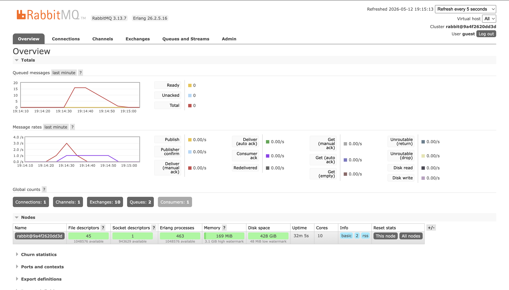

# Subscriber - Event-Driven Architecture (Module 9)

**Nama**: Galih Nur Rizqy  
**NPM**: 2406343224

## Deskripsi

Program ini adalah subscriber dalam sistem Event-Driven Architecture. Tugasnya mendengarkan event yang masuk ke message broker RabbitMQ, lalu memproses setiap event tersebut. Event yang diproses adalah `user_created` yang membawa data `user_id` dan `user_name`.

## Pertanyaan dan Jawaban

### a. Apa itu AMQP?

AMQP singkatan dari Advanced Message Queuing Protocol. Ini adalah protokol jaringan yang dipakai untuk komunikasi antar aplikasi lewat sebuah message broker. Cara kerjanya, pengirim (publisher) tidak langsung kirim pesan ke penerima (subscriber), tapi lewat broker dulu sebagai perantara. Dengan begitu, publisher dan subscriber tidak perlu tahu satu sama lain, cukup sepakat soal nama queue dan format pesannya saja. AMQP juga mengatur bagaimana pesan diantrekan dan dikirim ulang kalau gagal diproses. RabbitMQ adalah salah satu message broker yang mengimplementasikan protokol AMQP ini.

### b. Apa arti `guest:guest@localhost:5672`?

URL ini adalah alamat koneksi ke RabbitMQ yang dipakai oleh subscriber. `guest` yang pertama adalah username untuk login ke RabbitMQ, dan `guest` yang kedua adalah passwordnya. Keduanya adalah kredensial default bawaan RabbitMQ yang biasa dipakai saat development di lokal. `localhost` artinya server RabbitMQ-nya jalan di komputer yang sama dengan program ini. `5672` adalah port yang dipakai RabbitMQ untuk menerima koneksi AMQP. URL ini sama persis dengan yang dipakai publisher, artinya keduanya nyambung ke broker yang sama sehingga pesan dari publisher bisa sampai ke subscriber.

## Simulasi Slow Subscriber

Subscriber dibuat lambat dengan menambahkan `thread::sleep` selama 1 detik untuk setiap pesan yang diproses. Saat publisher dijalankan beberapa kali secara cepat, antrian di RabbitMQ langsung menumpuk karena publisher bisa mengirim ratusan event per detik sedangkan subscriber hanya mampu memproses 1 event per detik. Grafik queued messages di RabbitMQ terlihat naik tajam setiap kali publisher dijalankan dan turun perlahan seiring subscriber memproses satu per satu. Ini menggambarkan kondisi nyata seperti saat SIAK War, di mana banyak request datang sekaligus sementara server butuh waktu untuk memproses tiap request. Keunggulan event-driven di sini adalah sistem tidak crash meskipun kewalahan, karena semua request tetap tersimpan di queue dan akan diproses secara bertahap. Tanpa message broker, request yang datang terlalu cepat bisa langsung membebani server dan berpotensi menyebabkan crash.
